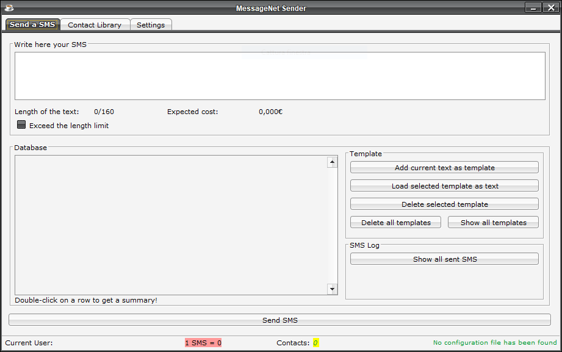

# :large_blue_diamond: MessageNet SMS Sender

> **When you need something but you can't find it... _JUST CREATE IT_** :shipit:

## :large_orange_diamond: Description
_This project doesn't follow any programing standard/guidelines, it was coded by a monkey (myself)  :stuck_out_tongue:_

A project developed on my school days. It will not developed anymore. **The software is available as it is.**

It is a Maven project created with NetBeans 8.2, you can open it with other IDEs but you will not be able to open the forms (GUI).

## :large_orange_diamond: Usage
_CURRENTLY IT WORKS ONLY FOR ITALIAN NUMBERS. AT THE TIME WHEN I NEEDED IT, MY AIM WAS TO SENT SMS ONLY IN ITALY_
Use this applicaiton is very easy!

1. Enter your messagenet account (username & password)
2. Checkout and enter the current SMS cost for your destination
3. Insert/Import/Load your contacts
4. Write your desidered sms text
   - If you enable SMS costumization a specific note will appear!
5. Click on Send button!
   - Remember that you need to have enough credit on your account! (Any error will be reported to you with a shorty explaination of what you maybe did wrong)
   - On successful sent, all the contacts will be saved on Database and a history saved

## :large_orange_diamond: Features
- Local SQLite database ([diagram here](./DBScheme.png)), you can:
  - Save/Load your contacts from it;
  - Save/Load SMS templates
  - Keep a history of your sent sms
- Import/Export your contact from/to CSV
  - You can choose 6 different format
- Import/Export application configuration
- Multilanguage: **Italian & English**
- Customize your SMS with the contact name!
  - You need to go to Settings and select the Send method
- Forecast the costs
  - You need to set-up the cost in Settings
- 160+ characters SMS support
  - Sent this type of SMS will be expensive!

## :large_orange_diamond: TO-DO (If I will ever reopen it someday :scream:)
- [x] Make it works for my own needs
- [x] Multilanguage
- [x] Local Database
- [x] CSV Support
- [ ] Non-Italian number prefix support
- [ ] Multi-profile system
- [ ] Crypt the database (only if Multi-profile system is implemented)
- [ ] Clear and improve the code

## :large_orange_diamond: Build your executable
1. Open the project with NetBeans 8.2
2. Click on "Clear and Build Project"
   - You need a internet connection to allow NetBeans to index Maven repos and retrieve any dependencies
   - On ProjectFolder/target you will find 2 jar files: the bigger one is a [FAT JAR](https://stackoverflow.com/questions/19150811/what-is-a-fat-jar)

## :large_orange_diamond: This application uses the following libs
- [SQLite JDBC Driver](https://github.com/xerial/sqlite-jdbc) 
- [JTattoo](http://www.jtattoo.net/)
- [AbsoluteLayout for NetBeans](https://mvnrepository.com/artifact/org.netbeans.external/AbsoluteLayout?repo=netbeans)

## :large_orange_diamond: License :copyright:
[This Project is under GNU GPLv3]

## :large_orange_diamond: Legal :warning:
This is a full Open Source software. You can fork and do your modification but at least keep the credits!
_This Project is in no way affiliated with, authorized, maintained, sponsored or endorsed by Messagenet S.p.A._